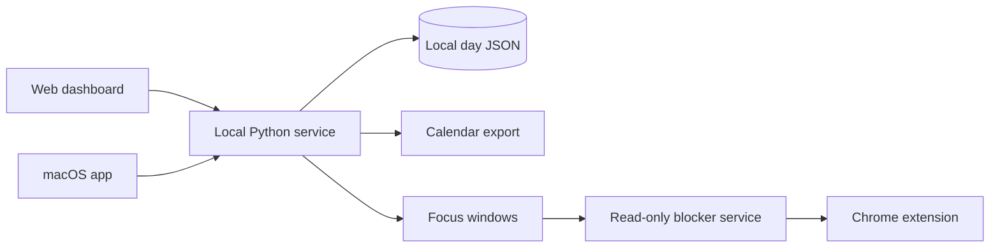

# daaaay.

> 今天，一件一件来。

daaaay 是一个 **local-first 的个人日程与专注工具**。它把每日安排、当前任务、累计计时和可选的网站限制放在同一套本地数据里，并同时提供网页与 macOS 原生界面。

项目仍在早期阶段，优先解决一件朴素的事：少在“我接下来该做什么”上消耗精力，先开始眼前这一件。

## 已实现

- **每日安排**：创建、编辑、删除和分类事项，支持无固定时间与跨午夜任务。
- **执行状态**：计划中、进行中、暂停、完成和取消；服务端保存累计计时。
- **双端界面**：本地网页，以及 SwiftUI + AppKit 编写的 macOS 原生应用。
- **Daylight Workbench**：固定浅色的三栏工作台；窗口缩窄时自动收起月历侧栏并重排当前事项。
- **滚动时间编辑**：日期选择、五分钟步进的小时/分钟滚轮、快捷时长，以及明确的跨午夜与 24 小时事项。
- **事务式跨日移动**：修改事项日期时同时保护来源日、目标日和计时字段，冲突或中断不会留下半移动状态。
- **悬浮当前任务**：在小窗中查看当前事项、计时，并快速开始、暂停或完成。
- **并发保护**：基于 revision 检测网页与原生端的编辑冲突，避免旧数据静默覆盖新数据。
- **日历导出**：生成标准 `.ics` 文件，由用户在系统日历中确认导入。
- **可选专注限制**：Chrome Manifest V3 扩展仅在明确配置的时段限制 `douyin.com` 及其子域名。
- **本地优先**：核心服务只监听 `127.0.0.1`，不依赖云数据库，不上传日程，也不调用后台 AI。

## 架构



正式日程、计时和 revision 由 `web/server.py` 统一管理。网页与 macOS 应用都是同一份本地数据的客户端；网站限制使用独立的只读回环服务，不读取任务标题、网页正文或浏览历史。

## 快速开始

### 运行网页

需要 Python 3.11+，核心服务只使用标准库。

```bash
git clone https://github.com/YIKUAIBANZI/daaaay.git
cd daaaay
python3 web/server.py
```

浏览器打开 [http://127.0.0.1:18765](http://127.0.0.1:18765)。首次保存日程时会在本地创建 `days/`；该目录已被 Git 忽略。

### 构建 macOS 应用

需要 macOS 13+ 和 Swift 5.9+。请先保持本地网页服务运行。

```bash
bash native/build.sh
open native/build/daaaay.app
```

默认快捷键：

| 操作 | 快捷键 |
| --- | --- |
| 显示或隐藏悬浮窗 | `Control + Option + Space` |
| 呼出完整日程 | `Control + Option + D` |
| 关闭主窗口并保留菜单栏 | `Command + W` |

构建产物使用本机 ad-hoc 签名，没有 Developer ID 公证，因此它更适合源码构建和个人使用，而不是直接分发安装包。

### 启用可选的 Chrome 限制

先创建一份空的本地时间表并启动只读服务：

```bash
cp blocker/schedule.example.json blocker/schedule.json
python3 blocker/server.py
```

然后在 `chrome://extensions` 开启开发者模式，选择“加载已解压的扩展程序”，加载 `blocker/extension/`。

扩展只影响安装它的 Chrome 配置，可以随时禁用或移除。它不是设备管理工具，也不会阻止用户使用其他浏览器或设备。

## 验证

```bash
python3 -m unittest discover -s tests
node --test tests/schedule.test.mjs
swift run --package-path native DayCoreChecks --http
```

测试使用临时目录和回环端口，不应写入真实日程或系统日历。

## 数据与隐私

- 日程保存在本地 `days/YYYY-MM-DD.json`。
- 写操作校验来源、临时访问令牌和 revision。
- 服务只绑定回环地址，不接受局域网或公网连接。
- Chrome 扩展仅接收限制窗口的 ID 与起止时间。
- 项目不采集屏幕、键盘、窗口标题、网页内容或浏览历史。
- 仓库忽略真实日程、监督记录、限制时间表、构建产物和本机配置。

公开仓库并不意味着个人数据也应公开。提交前请保留 `.gitignore` 中的隐私规则，并再次检查暂存文件。

## Roadmap

- 根据真实使用继续打磨监督流程、交互细节与移动端协作方式。
- 通过 MCP + Skill 让本地 Agent 读取日程并生成待确认草案；该集成将在产品需求稳定后继续，正式写入仍须用户接受。
- iPhone 客户端与更细的设备专注能力，作为独立后续方向评估。

Roadmap 代表设计方向，不代表当前版本已经交付。

## 项目结构

```text
web/                 本地 HTTP 服务与网页界面
native/              SwiftUI/AppKit macOS 客户端
blocker/             Chrome 扩展与只读时间表服务
tests/               Python、Node 与 HTTP 行为测试
```

## 开源状态

仓库暂未附加开源许可证。在许可证明确前，代码默认保留全部权利。
